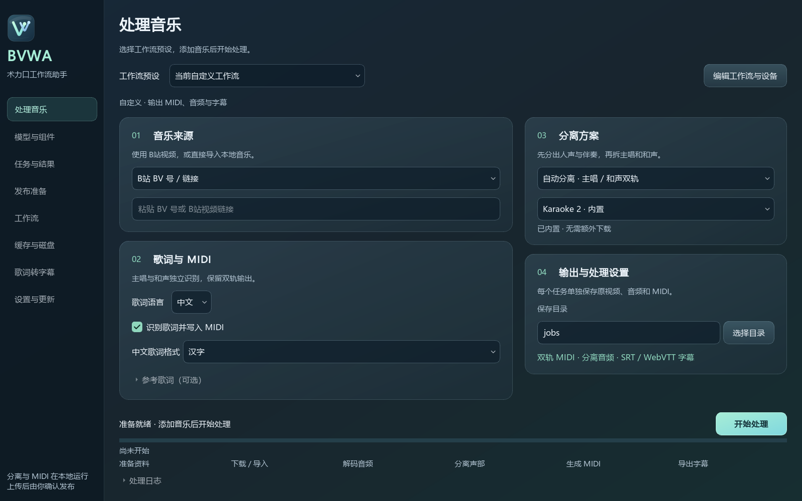

<p align="center"></p>

# Better Vocaloid Workflow Assistant

术力口工作流助手 (BVWA)

[English](README.md) | [简体中文](README.zh-CN.md)

A desktop assistant for preparing vocal-synthesis projects on Windows. Import a song or a Bilibili video, separate its vocal parts, and export MIDI with aligned lyrics. After tuning, prepare the finished video's cover, credits and creator uploads.

> **v0.3.0 is available.** This release adds reusable workflows, task management, subtitles, a console-free launcher and verified updates. Upgrading from v0.2.0 requires the complete portable package.

## Features

- Bilibili BV/link input and local audio import.
- Vocals/accompaniment separation, with separate lead and backing-vocal MIDI tracks.
- Built-in Karaoke 2 and an optional BS-RoFormer component for CPU or NVIDIA GPU.
- Chinese and Japanese lyrics; Chinese MIDI lyrics can use characters or pinyin.
- Resumable tasks, reference lyrics and full-length external WAV stems.
- Draggable workflows with saved presets and per-engine CPU/GPU settings.
- Searchable task history, stage progress, recovery actions and cache management.
- Editable lyric timing with LRC/TXT/CSV/MIDI input and SRT/WebVTT output.
- Original video covers, editable credits, and Bilibili/Xiaohongshu upload preparation.
- A console-free Windows launcher and verified program updates.

Tuning, final mixdown/video alignment and the final publishing action remain manual. Review the separated audio, pitches and lyrics before using them in a finished project.

## Getting started

1. Download the complete portable package from [Releases](https://github.com/Transilent/Better-Vocaloid-Workflow-Assistant/releases). The generated **Source code** archives contain source, rather than the bundled runtime.
2. Keep all ZIP parts and `release-assets.json` in one folder. Open `.001` with 7-Zip, or use `Merge-PortableParts.ps1` to verify and join the parts.
3. Extract the complete `BVWA` folder to a writable location, such as `D:\BVWA`.
4. Start **`BVWA.exe`**.
5. In **处理音乐** (Process music), select a workflow preset and add the input, then select **开始处理** (Start).

## Upgrading from v0.2.0

Version 0.3.0 uses a revised base-runtime inventory and requires the complete portable package. Close the assistant and extract the new package into a separate folder. To retain data on the same computer, copy `config.json`, `jobs/`, `publish-packages/`, `last_job.txt`, `cache/workspace.json` and `cache/publish-browser/` from the old folder when present. An installed BS-RoFormer component can be retained by copying `dependencies/optional/bs-roformer/`. Keep custom task directories in their existing locations. Avoid copying old program files or update caches over the new package. On another computer, sign in to the publishing platforms again.

The program-only update is for installations with the same base runtime. When that runtime differs, Settings/updates directs you to the complete package.

The interface currently uses Chinese labels. See the [English user guide](docs/UserGuide.en.md) for controls and outputs.



## Save location

In **输出与处理设置** (Output/processing settings), use **选择目录** (Choose folder) to set the save location, or enter a new folder path. The default is the assistant's `jobs` folder. Each task creates a separate subfolder containing the downloaded video (`video/source.mp4` for BV inputs), audio and MIDI. The assistant remembers the chosen location and earlier task folders. Resuming uses the original task folder; reprocessing creates a new task in the currently selected save location.

## Lyrics and output

With Chinese selected, **中文歌词格式** chooses **汉字** (characters) or **拼音** (pinyin). The selected format applies to both vocal tracks and is saved with the task. Disable **识别歌词并写入 MIDI** to export notes without lyrics. The Chinese format setting does not affect Japanese transcription.

Reference lyrics are optional. Enter lead and backing lyrics separately; include only the sung text. Find completed files in **任务与结果** (Tasks/results).

| File | Content |
| --- | --- |
| `midi/voices.mid` | Lead and backing vocal tracks on a shared timeline |
| `midi/lead/lead.mid`, `midi/backing/backing.mid` | Individual vocal parts |
| `midi/vocals.mid` | Combined-vocal mode output |
| `audio/lead.wav`, `audio/backing.wav` | Separated vocal parts |
| `audio/instrumental.wav` | Accompaniment |

In VOCALOID 6, use **File → Import** for MIDI and select UTF-8 when a lyric-encoding option is provided. MIDI timing uses 120 BPM as a time reference; this is not automatic song-tempo detection.

## Workflows, tasks and recovery

Select a built-in or saved preset from **工作流预设** at the top of **处理音乐** (Process music), add a song, and click **开始处理**. The selected graph, model, language, lyric format and devices are applied together. To edit a workflow, open **工作流**, save it, and click **用于处理音乐** to return. Preset selections stay synchronized between both pages.

Drag modules from the palette. Moving a module near a compatible neighbor shows a connection preview; releasing it snaps the modules into alignment and connects them. Pull a module away and release to disconnect. Double-clicking a palette item appends it after its predecessor. Click a module to edit its parameters; right-click to remove a module or connection. **整理画布** arranges modules in processing order and connects adjacent compatible modules. Ctrl + wheel zooms.

The supported sequence is **Music input → Separation → MIDI → Subtitles**. Ending at Separation exports audio without running MIDI inference. The subtitle node exports SRT and WebVTT from MIDI lyric events. Incomplete or invalid connections are rejected before creating a task. Input files, BV links and reference lyrics are entered on the processing page.

Select a node to change language, model, lyric format, extraction precision or device. The base separation and MIDI engines offer CPU/DirectML; the optional BS-RoFormer engine offers Auto/CPU/CUDA. Current settings and named presets are saved locally. Presets contain processing parameters and the graph, without song paths or reference lyrics. Existing tasks retain their recorded settings; **用当前工作流重做** creates a new task using the current workflow and the original input.

**任务与结果** supports search, status filters, sorting and renaming. The task menu can open logs, send MIDI lyrics to the subtitle editor, or delete a task after confirmation. Deleting a task removes its files permanently. A run interrupted by an application exit is shown as interrupted and can be resumed.

Progress shows the active stage, voice or model subtask, completed stages and elapsed time. Measurable subtasks show processed chunks or download size/speed; stage counts are not estimates of remaining processing time. Failures show a readable explanation and a retry action. Device failures also offer **改用 CPU 继续**; disk-space failures link to disk management. Completed stages are reused when their outputs remain valid.

## Disk management and subtitles

In **缓存与磁盘**, scan disk usage, select cache or temporary-file entries, and confirm cleanup. Tasks, installed models, sign-in sessions and presets are protected. Cleanup waits until processing, component installation and upload preparation have finished. Removing task temporary files may require regenerating them on retry.

**歌词转字幕** imports UTF-8 LRC, TXT, timed CSV (`start,end,text` in seconds), and MIDI lyric events. Preview and edit each cue, apply a global time offset, then export UTF-8 SRT or WebVTT. LRC timestamps are preserved, including repeated timestamps and offset tags. Empty timestamped lines end the preceding cue. A final line without an end marker defaults to three seconds. MIDI phrase boundaries are inferred from lyric pauses. Plain text has no timing: the tool distributes lines across a user-specified duration as an initial estimate and requires manual checking.

The portable inventory excludes development installers, third-party tests, unused Qt Quick resources and an alternate HFA export that the pipeline never loads. Active Chinese/Japanese ASR and pitch/alignment weights remain unchanged. The current inventory saves approximately 447 MB of extracted space; the compressed size is measured when an approved release is built.

## Optional model and download sources

Open **模型与组件** (Models/components), choose the runtime and download source, then select **下载并安装** (Download/install). After installation, select **使用此模型** (Use model).

| Runtime | Download | Installed space, approximately |
| --- | --- | --- |
| CPU | 0.46 GB | 1.56 GB |
| NVIDIA GPU / CUDA | 3.52 GB | 6.14 GB |

The installer supports cancellation, resume and SHA-256 verification. The original BS-RoFormer checkpoint is used for both lyric languages. Japanese transcription retains the existing Romaji ASR model.

Download options are **Auto**, **Official sources**, and **Prefer acceleration**. Auto tries an alternate source after a connection failure. GitHub downloads support [GitProxy](https://gitproxy.dev/guide); Hugging Face weights support [HF-Mirror](https://hf-mirror.com/). Other runtime packages use their official sources. Availability and speed depend on the selected service and network.

## Program updates

Open **设置与更新** (Settings/updates) to check versions, read release notes and choose the default download source. Startup checks and automatic background downloads are configurable. Once a download has been verified, select **重启并安装更新** (Restart/install) when the current task is finished.

Program updates use a small update package. Settings, jobs, platform sign-in and installed models are preserved. Failed file replacement restores the previous program files. Releases that change the base runtime require the complete portable package.

`release-assets.json` contains release metadata and checksums. Version 0.3.0 includes a program update package for compatible base runtimes; v0.2.0 requires the complete package.

## Upload preparation

In **发布准备** (Publication), choose the source task and finished video. Review the source cover, titles and credits, prepare the publication files, then sign in and upload to the selected platforms. The assistant leaves the creator pages open for review and manual publishing.

Original covers come from the video's metadata. Frame capture and custom images are separate choices. Cover conversion preserves the complete image with padding when required.

## Requirements and troubleshooting

- Windows 10/11 x64; 16 GB RAM is recommended.
- Reserve approximately 25 GB for downloading, joining and extracting the portable package. Optional components and media need additional space.
- Keep `dependencies`, `models`, `assets` and `components` with the executable. Transfer the complete folder to another computer.
- Startup errors are recorded in `launcher.log`. Diagnostic controls are in `tools/`.
- Platform sign-in is required on each new computer.

| Diagnostic tool | Purpose |
| --- | --- |
| `tools/Start-Diagnostics.bat` | Start with visible diagnostic output; install a missing runtime |
| `tools/Check-Dependencies.bat` | Verify bundled runtime files |
| `tools/Use-CPU.bat`, `tools/Use-GPU.bat` | Select CPU/DirectML for the base pipeline |

## Development

The repository contains source, tests and build tools. Models and large runtime files are distributed separately. For a source checkout, use `tools/Start-Diagnostics.bat` to install the runtime, then build the EXE with `tools/build_windows_launcher.py`.

```powershell
& '.\dependencies\vocal2midi\python\python.exe' -B .\tools\build_windows_launcher.py
& '.\dependencies\vocal2midi\python\python.exe' -B .\tests\run_tests.py
& '.\dependencies\vocal2midi\python\python.exe' -B .\pipeline.py --audio-file 'D:\Music\song.wav' --zh-lyric-mode pinyin
```

User data under `cache/`, `jobs/` and `publish-packages/` is excluded from clean packages and Git. See [Contributing](CONTRIBUTING.md), [Changelog](CHANGELOG.md) and the [architecture](docs/Architecture.en.md). Release packaging requires passing automated checks and confirmed user testing.

## Related projects and acknowledgements


This assistant integrates existing tools and model pipelines. Thanks to their authors and contributors.

| Project | Use in this assistant |
| --- | --- |
| [Vocal2Midi](https://github.com/Xiantaidu/Vocal2Midi) | Vocal transcription and lyric-aligned MIDI through its bundled application layer; Apache-2.0 repository |
| [Ultimate Vocal Remover](https://github.com/Anjok07/ultimatevocalremovergui) and [UVR model repository](https://github.com/TRvlvr/model_repo) | MDX inference reference, separation weights and parameter metadata; the UVR desktop app is not required |
| [yt-dlp](https://github.com/yt-dlp/yt-dlp) | Bilibili media downloading |
| [FFmpeg](https://ffmpeg.org/) / [Jellyfin FFmpeg](https://github.com/jellyfin/jellyfin-ffmpeg) | Audio decoding, media inspection and cover-frame extraction |
| [Playwright for Python](https://github.com/microsoft/playwright-python) | Browser sign-in and creator-page automation |
| [ONNX Runtime](https://github.com/microsoft/onnxruntime) | CPU / DirectML model execution |
| [PyQt](https://www.riverbankcomputing.com/software/pyqt/) | Desktop interface |
| [Pymss](https://github.com/pymss-project/pymss) | Optional BS-RoFormer inference API and model implementation |
| [Pymss Studio](https://github.com/pymss-project/pymss-studio) | Workspace layout and model-management workflow reference |
| [becruily / BS-RoFormer karaoke](https://huggingface.co/becruily/bs-roformer-karaoke) | Original optional checkpoint and configuration |
| [PyTorch](https://pytorch.org/) | Optional CPU / CUDA inference runtime |
| [NumPy](https://numpy.org/), [SciPy](https://scipy.org/), [librosa](https://librosa.org/), [SoundFile](https://github.com/bastibe/python-soundfile), [Mido](https://github.com/mido/mido), [Pillow](https://python-pillow.org/) | Audio, numeric, MIDI and image processing |

Vocal2Midi's pipeline also builds on [GAME](https://github.com/openvpi/GAME), [HubertFA](https://github.com/wolfgitpr/HubertFA), [LyricFA](https://github.com/wolfgitpr/LyricFA), and [llama.cpp](https://github.com/ggml-org/llama.cpp), alongside its ASR and pitch models. See its preserved [acknowledgements](dependencies/vocal2midi/ACKNOWLEDGEMENTS.md) and the [third-party notices](THIRD_PARTY_NOTICES.md) for attribution and component-specific terms. These projects and models retain their own licenses; this list does not grant a common license to the package.
